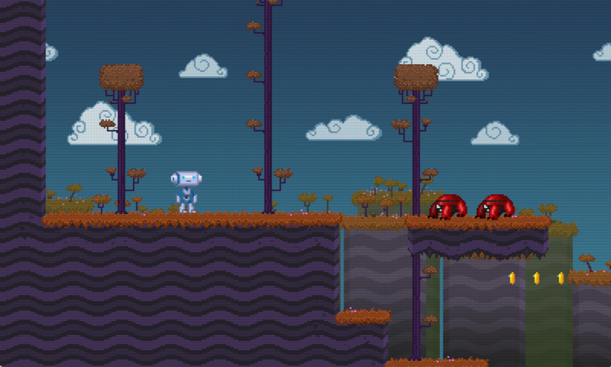

# Godot CRT Screen Shader

AaronWizard
2018

A Godot screen shader for simulating CRT screens.

Based on the [*CRT-Easymode* algorithm](https://github.com/libretro/glsl-shaders/blob/master/crt/shaders/crt-easymode.glsl).

## How to use

Create a node that covers your scene, like a ColorRect, and assign it a ShaderMaterial that uses the CRT shader code. You will likely want this node to go in a CanvasLayer, like if you're using a Camera in the scene.

The shader's parameters are taken from the original CRT-Easymode shader, but with the addition of *Screen Base Size*. The most important parameters are:

| Shader Param | Description|
|--------------|------------|
| Screen Base Size | The virtual minimum pixel dimension, width or height, of the scene. This should be the minimum of your Width and Height settings under *Project Settings > Display > Window > Size*. |
| Mask Strength | How much the original scene's colours will be replaced by the colouring of the RGB cell pattern. |
| Mask Dot Width | Multiplier for the widths of the RGB cells, based on *Mask Size*. |
| Mask Dot Height | Multiplier for the heights of the RGB cells, based on *Mask Size*. |
| Mask Stagger | Shifts the odd row RGB cells by this amount multiplied by *Mask Size*. |
| Mask Size | The base width and height in screen pixels of the RGB cells. |
| Scanline Strength | How visible the scanlines are. |
| Scanline Cutoff | The minimum height the screen must be in order to show the scanlines. |
| Gamma Input | Represents the gamma of the simulated CRT monitor, which was typically between 2 and 5. Darkens the scene the higher this is. |
| Gamma Output | The corrected gamma converted from *Gamma Input* for display on an LCD monitor. Brightens the scene the higher this is. |
| Bright Boost | Brightens the scene depending on how high the value is, independent of the gamma settings. |
